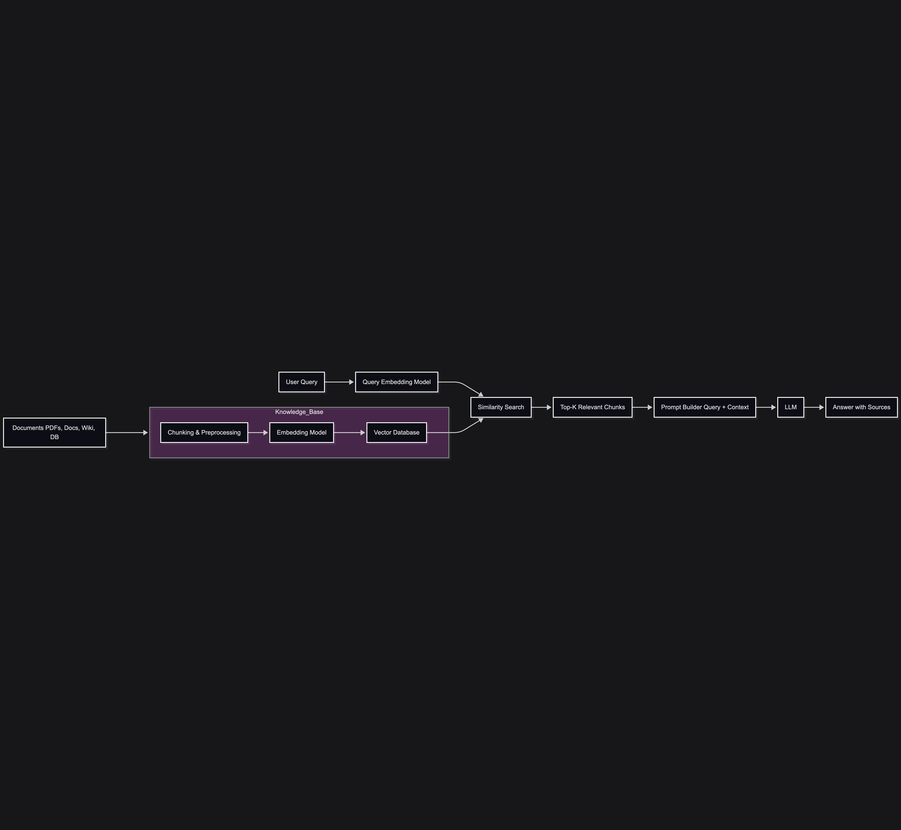

# Warehouse File Archiver Project 
This document gives a breif about the file archiver system architecture involving RAG, project done during the period of internship.

### The Architecture highlights the RAG pipeline as to align with the task

The Diagram below is a simple RAG workflow, for understanding the basic steps involved in RAG

___ 
## Architecture

### Backend: ASP.NET Core 9.0 (C#)

- RESTful API with JWT authentication
- PostgreSQL database with Entity Framework Core
- Semantic search using Ollama LLM integration
- Rate limiting and comprehensive logging (Serilog)

### Frontend: Angular 20 (TypeScript)

- Standalone components with Angular Material UI
- Role-based access control
- Real-time file management interface

### Core Features

**File Management**
- Upload/Download: Versioned file storage with checksum validation
- File Versions: Track multiple versions of files with metadata
- Semantic Search: AI-powered file search using embeddings (Ollama)
- Summarization: LLM-based file summarization with role-based permissions

**Access Control**

- Role-Based: Employees have roles with category-specific permissions
- Category Access: Granular upload/download permissions per role-category combination
- Access Levels: Public/Private/Internal file access tiers
- Audit Logging: Track all entity changes with user and timestamp

**Data Management**

- Categories: File organization and classification
- Media Types: Support for different file formats (.pdf, .docx, etc.)
- Employees: User profiles with contact information
- Employees: User profiles with contact information

---

