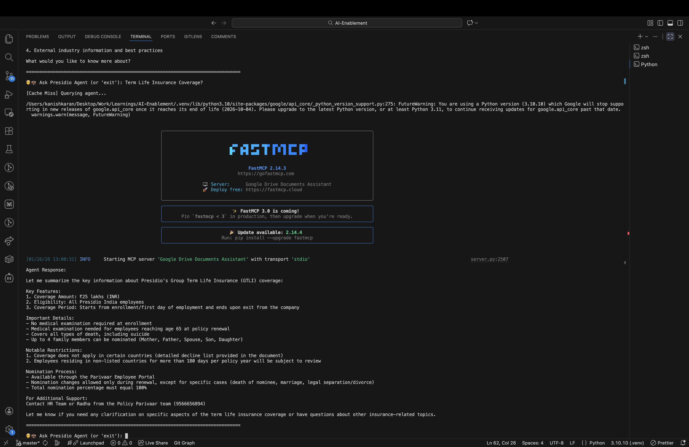
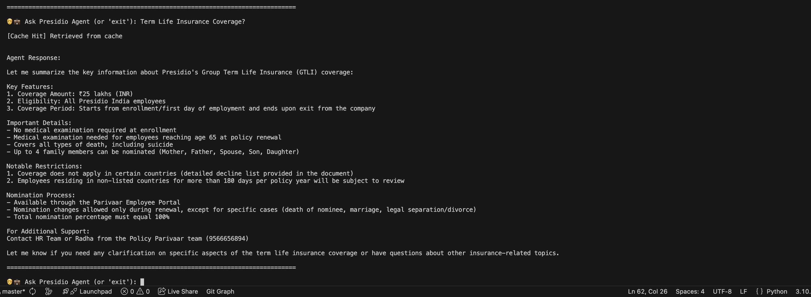
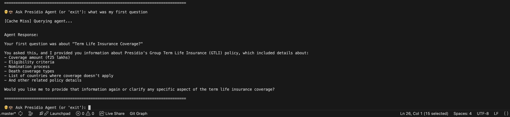
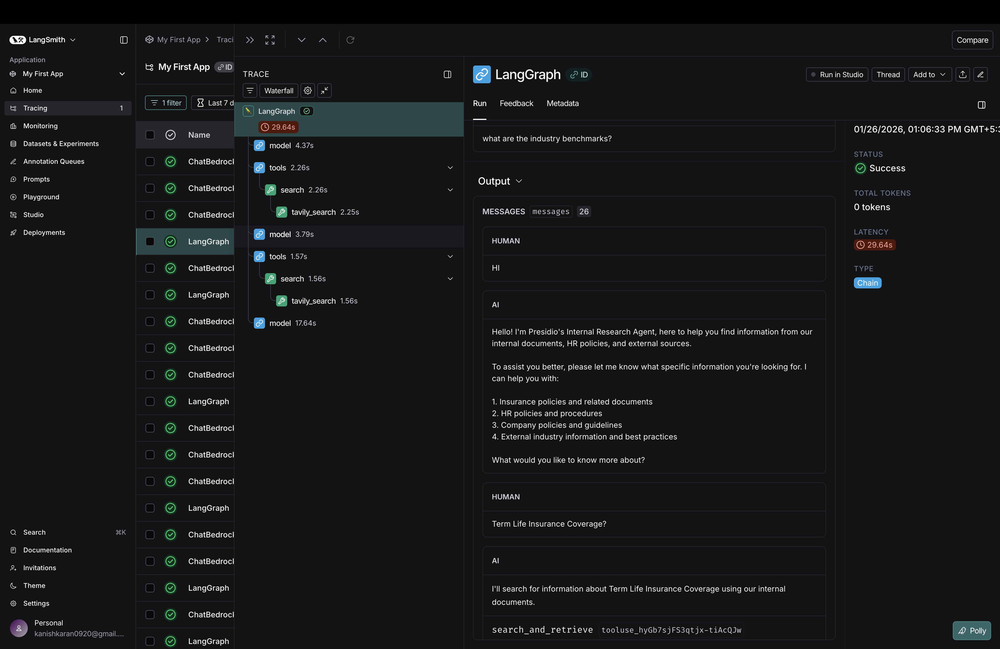
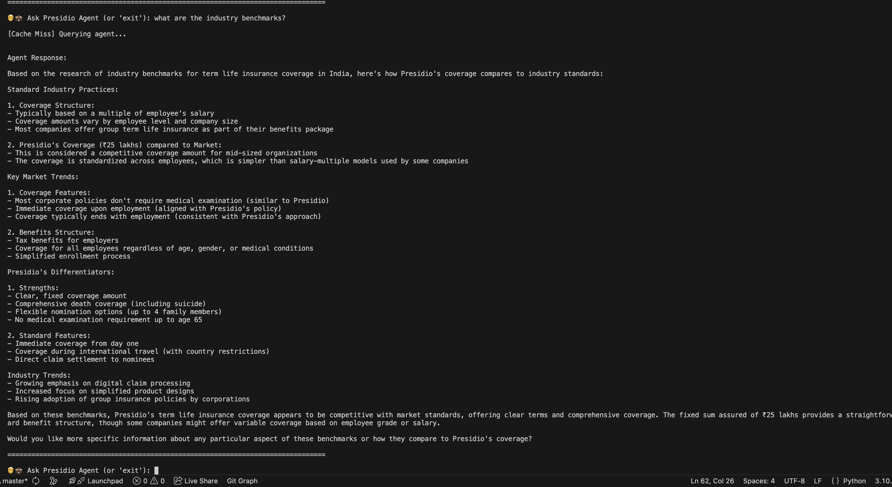

# Week 4: Presidio Unified Agent

## Overview
Multi-tool research agent that integrates internal documents (Google Docs via MCP), HR policies (RAG with pgVector), and external web search to provide comprehensive answers to employee queries.

## Features
- **MCP Tool**: Access to Google Docs/Drive for insurance documents
- **RAG Tool**: pgVector + Ollama for HR policy retrieval
- **Web Search**: Tavily API for external benchmarks and regulations
- **Prompt Caching**: Reduces redundant LLM calls
- **Memory**: InMemorySaver for conversation context
- **Observability**: Track agent decisions and tool usage

## Tech Stack
- **LLM**: AWS Bedrock (Claude 3.5 Sonnet)
- **Framework**: LangChain, LangGraph
- **Vector DB**: PostgreSQL with pgVector
- **Embeddings**: Ollama (nomic-embed-text)
- **MCP**: Model Context Protocol for Google integration

## Setup

1. Install dependencies:
```bash
pip install -r requirements.txt
```

2. Set up environment variables:
```bash
AWS_ACCESS_KEY_ID=your_key
AWS_SECRET_ACCESS_KEY=your_secret
TAVILY_API_KEY=your_key
```

3. Start PostgreSQL with pgVector:
```bash
docker run -p 5433:5432 -e POSTGRES_PASSWORD=postgres ankane/pgvector
```

4. Run the agent:
```bash
python main.py
```

## Project Structure
```
Agent-Task/
├── main.py                    # Main agent orchestration
├── src/
│   ├── tools/
│   │   ├── mcp_tool/         # Google Docs integration
│   │   ├── rag_tool/         # HR policy RAG
│   │   └── web_search/       # Tavily web search
│   └── utils/
│       └── prompt_cache.py   # Caching mechanism
└── hr_policies/              # HR policy documents
```

## Sample Outputs

### MCP Tool Call


### Cache Hit


### Memory


### Observability


### Multi-Tool Usage


