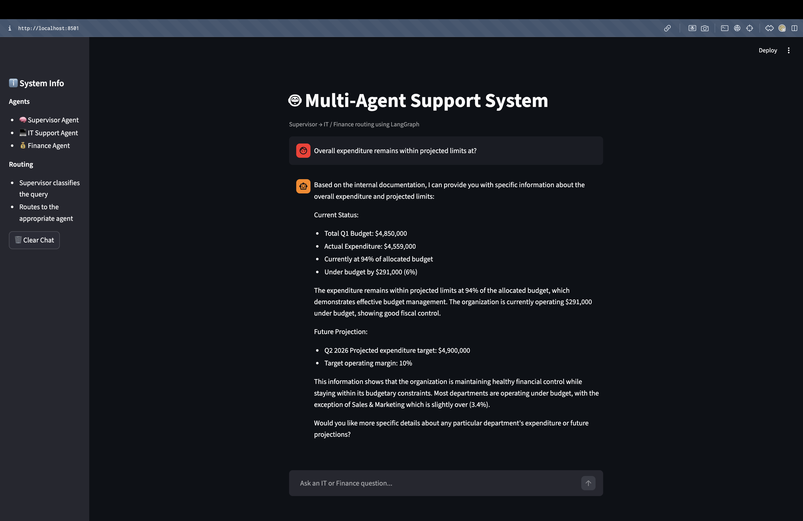
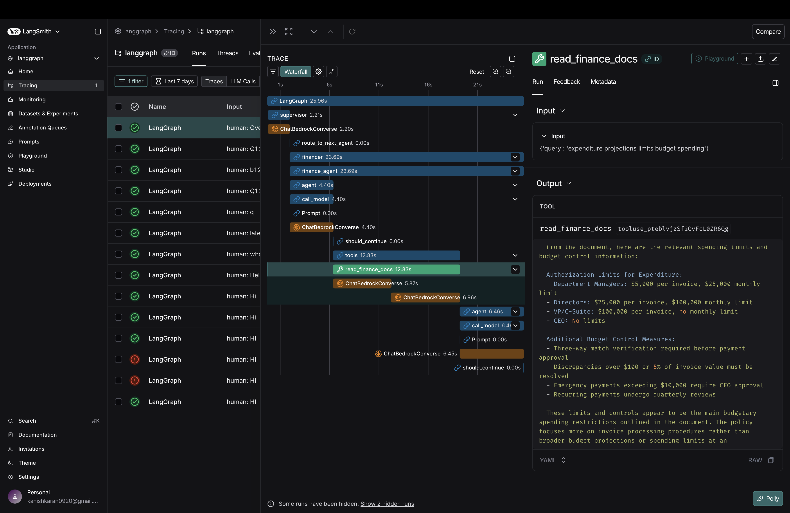
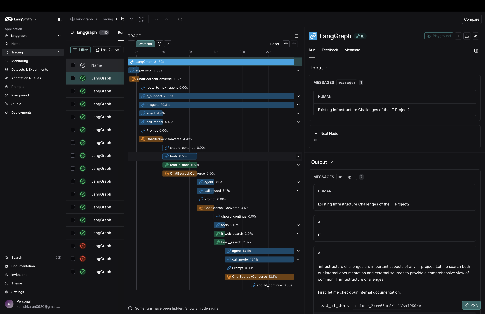

# Week 5: Multi-Agent Support System

## Overview
Streamlit-based multi-agent system with a supervisor agent that intelligently routes queries to specialized IT and Finance agents using LangGraph workflows.

## Features
- **Supervisor Agent**: Classifies queries and routes to appropriate specialist
- **IT Support Agent**: Handles technical support queries with file access
- **Finance Agent**: Manages financial queries with document retrieval
- **LangGraph Workflow**: State-based agent orchestration
- **Streamlit UI**: Interactive chat interface

## Tech Stack
- **Framework**: LangGraph for workflow orchestration
- **LLM**: AWS Bedrock (Claude 3.5 Sonnet)
- **UI**: Streamlit
- **Tools**: Custom file readers, web search

## Setup

1. Install dependencies:
```bash
pip install -r requirements.txt
```

2. Configure environment variables in `configuration.py`

3. Run the application:
```bash
streamlit run app.py
```

## Project Structure
```
Week-5/
├── app.py                    # Streamlit UI
├── workflow.py               # LangGraph workflow definition
├── configuration.py          # Settings and prompts
├── agents/
│   ├── supervisor_agent.py  # Query routing
│   ├── it_agent.py          # IT support
│   └── finance_agent.py     # Finance support
├── tools/
│   ├── read_file.py         # File reading tool
│   └── web_search.py        # Web search tool
├── prompts/
│   └── prompts.py           # Agent prompts
└── data/
    ├── finance/             # Finance documents
    └── it/                  # IT documents
```

## Sample Outputs

### Finance Query Response


### Finance Execution Trace


### IT Query Response


### IT Execution Trace


## Demo

[agent-demo-video](./week-5-demo.mov)