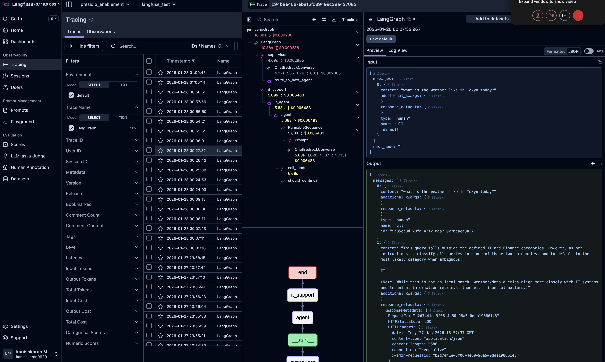

# Week 6: Guardrails & Langfuse Evaluation and Web Crawler

## Overview
Week 6 focuses on implementing safety guardrails using NeMo Guardrails and establishing comprehensive observability and evaluation with Langfuse and LLM-as-Judge frameworks.

## Sample Outputs

### Guardrails Demo
[Watch Demo Video](guardrails.mov)

### Trace Results

### Evaluation Results are below as readme
[evaluation](./langfuse_and_evaluation/llm_judge_evaluation.md)

## AWS WebCrawler Agent

[Watch Demo Video](aws_agent.mov)
